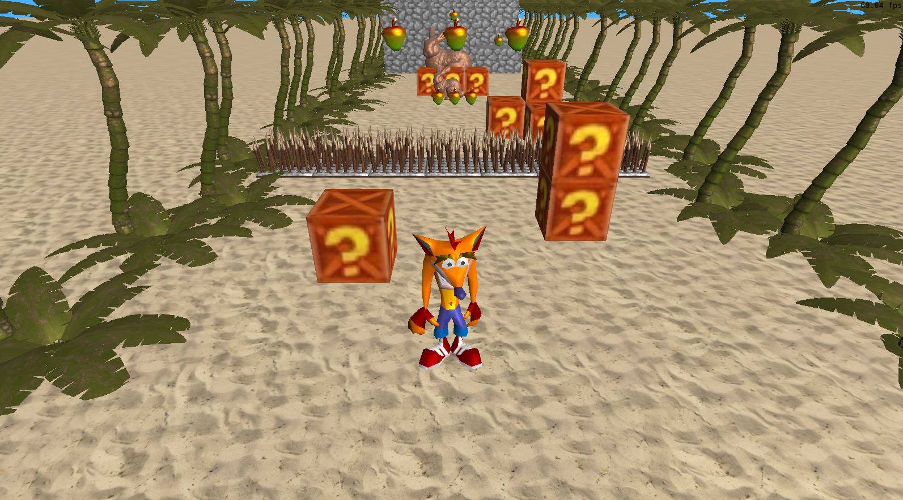
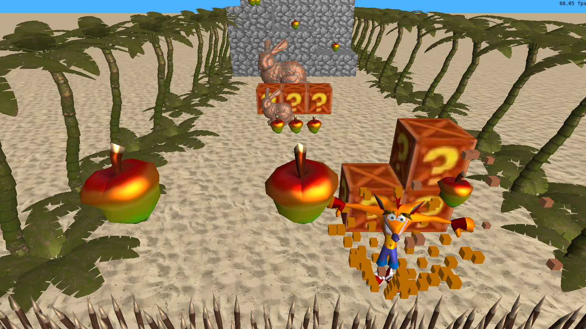
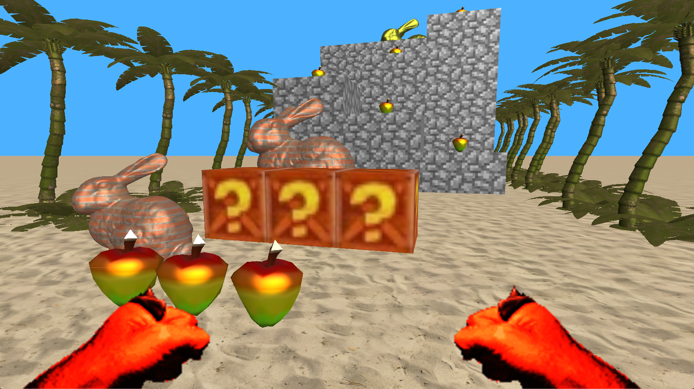

# Relatório
Nós, alunos Iuri Kali e Rafael Alexandrini, recriamos (de forma simplificada) a fase inicial do jogo Crash Bandicoot, do Playstation 1. 

Nossa versão possui os movimentos do Crash (andar, pular e girar), a câmera 'em trilho' tradicional do jogo, uma câmera em primeira pessoa, caixas, frutas coletáveis, inimigos e espinhos que forçam o jogador a reiniciar o jogo. 

Testes de colisão são feitos usando hitboxes [AABB](https://medium.com/@andrebluntindie/3d-aabb-collision-detection-and-resolution-for-voxel-games-5fcbfdb8cdb4). A iluminação é uma mistura do modelo de Phong - com parte especular e glossy - com uma iluminação difusa do modelo [Half-Lambert](https://developer.valvesoftware.com/wiki/Half_Lambert), já usado em jogos da Valve, como Half-Life. A instanciação dos objetos no mapa é feito por meio de um arquivo JSON na pasta /src, onde são definidos prefabs e onde são instanciados.

## Controles
WASD ou Setinhas para movimentação
Ctrl ou J para girar
P para alternar entre câmera de primeira e terceira pessoa
Mouse para mover a câmera de primeira pessoa
R para recarregar o mapa (armazenado em src/mapa1.json)

## Compilação

Passos presentes em COMPILACAO.md

Forma mais comum: com a extensão do CMake no VSCode, aperte no botão Build ou Launch na parte inferior da tela.
O executável fica em /bin/Debug/main.exe.

## Imagens

## Contribuição dos membros da dupla
Iuri:

Animação do personagem; Colisão; Física; Inimigos; Player; Espinhos; Partículas; Câmera em primeira pessoa;

Rafael:

Carregamento e criação do Mapa; Modelo de Iluminação; Câmeras; Movimentação do inimigo; Mapeamento de texturas;

## Uso de IA Generativa
Rafael: 

Usei principalmente Claude como forma de tirar dúvidas e gerar ideias. Por exemplo, o sistema de mapa em JSON foi sugerido por IA, mas a lógica implementada foi minha. Em geral, não usei para a escrita de código diretamente. 
Para tirar dúvidas achei bem útil, já que oferece respostas já no contexto específico deste projeto. Porém, não é perfeito: tentei usar para debugar certos erros e não conseguiu ajudar.

Iuri:

Usei somente o Gemini e todos os prompts que utilizei estão nesse link (https://share.gemini.google/JVI5w86iBS7Z
). O uso da IA foi fundamental para implementar a [Skeletal Animation] (https://learnopengl.com/Guest-Articles/2020/Skeletal-Animation) através da biblioteca [TinyGLTF] (https://github.com/syoyo/tinygltf), para desenhar as mãos do Crash em primeira pessoa e para criar o VBO do cubo de cor personalizada que foi utilizado no sistema de partículas (giro e quando quebra uma caixa). Também utilizei a IA para arrumar alguns bugs, tirar dúvidas sobre implementações e sobre C++ (que nunca tinha utilizado antes). Toda a lógica do personagem principal eu fiz utilizando os conhecimentos que aprendi sobre desenvolvimento de jogos 2D ao longo dos anos (desenvolvo jogos desde 2020).
