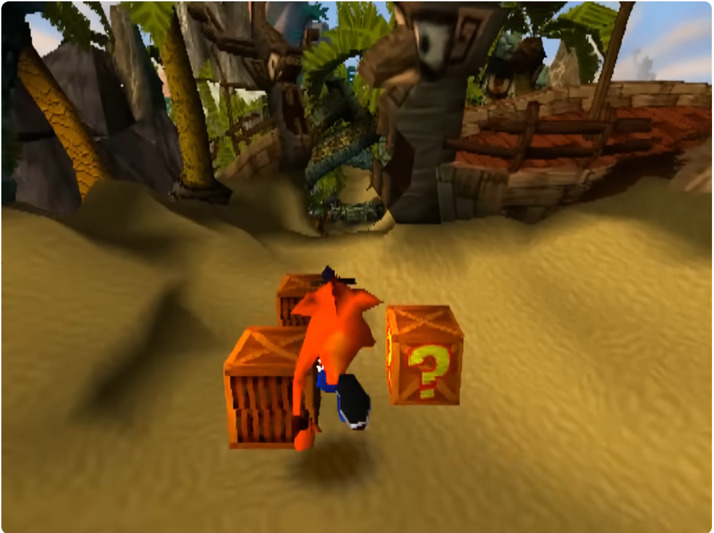
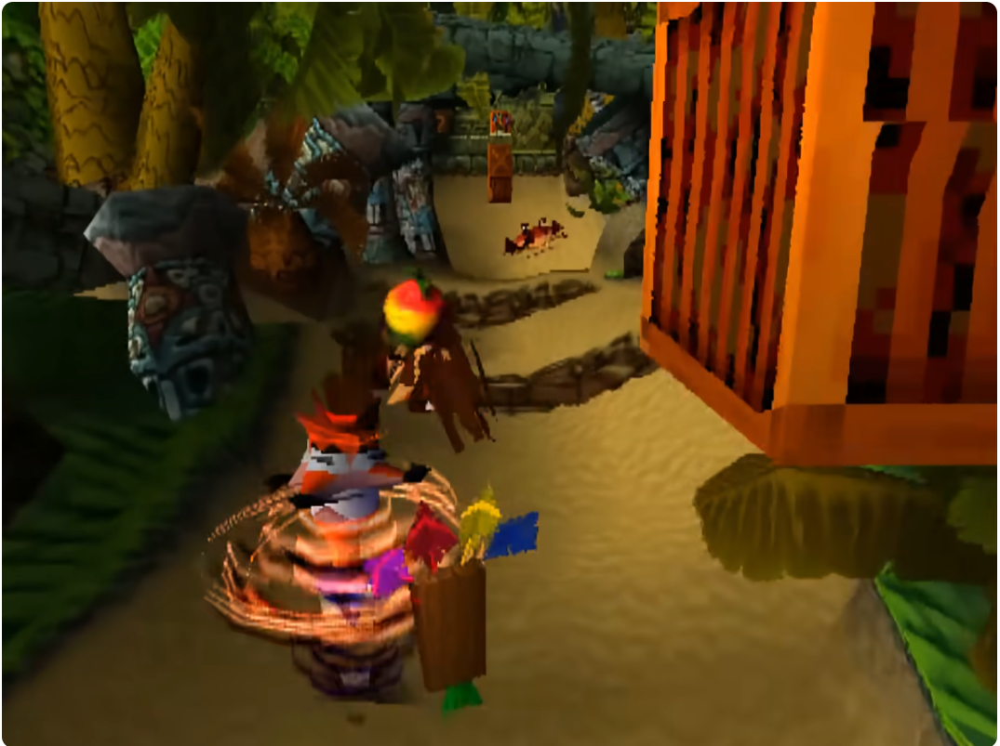
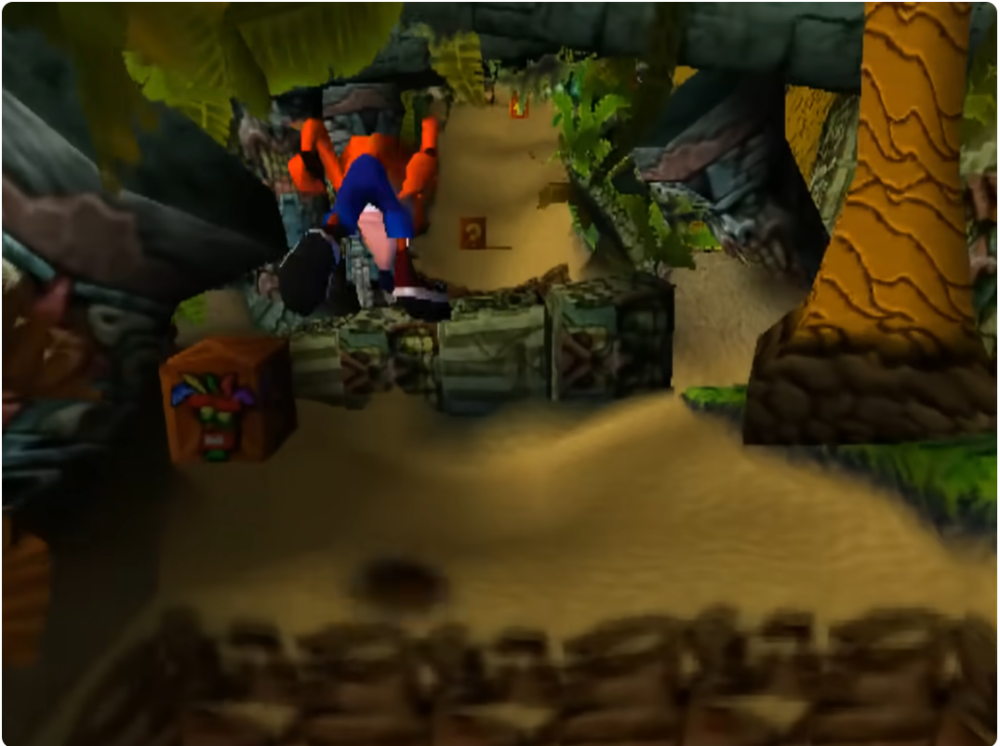

# Especificação da Implementação

> [!CAUTION]
> - Você <ins>**não pode utilizar ferramentas de IA para escrever esta
>   especificação**</ins>

## Integrantes da dupla

- **Aluno 1 - Nome**: <mark>`Iuri Kali Sieczkowski de Carvalho`</mark>
- **Aluno 1 - Cartão UFRGS**: <mark>`00580709`</mark>

- **Aluno 2 - Nome**: <mark>`Rafael Hillebrand Alexandrini`</mark>
- **Aluno 2 - Cartão UFRGS**: <mark>`00587786`</mark>

## Detalhes do que será implementado

- **Título do trabalho**: <mark>`Créxi Bandecute`</mark>
- **Parágrafo curto descrevendo o que será implementado**: <mark>`Uma versão simplificado do jogo Crash Bandicoot (1996)`</mark>

## Especificação visual

### Vídeo - Link

> [!IMPORTANT]
> - Coloque aqui um link para um vídeo que mostre a aplicação gráfica
>   de referência que você vai implementar. **Sua implementação deverá
>   ser o mais parecido possível com o que é mostrado no vídeo (mais
>   detalhes abaixo).**
> - **Você não pode escolher como referência: (1) algum trabalho realizado
>   por outros alunos desta disciplina, em semestres anteriores. (2) Minecraft.**
> - Por exemplo, você pode colocar um vídeo de um jogo que você gosta,
>   e seu trabalho final será uma re-implementação do jogo.
> - O vídeo pode ser um link para YouTube, Google Drive, ou arquivo mp4 dentro
>   do próprio repositório. Mas, garanta que qualquer um tenha
>   permissão de acesso ao vídeo através deste link.

<mark>`https://youtu.be/8IFNBiRymu4`</mark>

### Vídeo - Timestamp

> [!IMPORTANT]
> - Coloque aqui um **intervalo de ~30 segundos** do vídeo acima, que
>   será a base de comparação para avaliar se o seu trabalho final
>   conseguiu ou não reproduzir a referência.

- **Timestamp inicial**: <mark>`00:00`</mark>
- **Timestamp final**: <mark>`00:30`</mark>

### Imagens

> [!IMPORTANT]
> - Coloquei aqui **três imagens** capturadas do vídeo acima, que você
>   irá usar como ilustração para as explicações que vêm abaixo.

## Especificação textual

> [!IMPORTANT]
> - Coloquei aqui **três imagens** capturadas do vídeo acima, que você
>   irá usar como ilustração para as explicações que vêm abaixo.

Para cada um dos requisitos abaixo (detalhados no [Enunciado do Trabalho final - Moodle](https://moodle.ufrgs.br/mod/assign/view.php?id=6018620)), escreva um parágrafo **curto** explicando como este requisito será atendido, apontando itens específicos do vídeo/imagens que você incluiu acima que atendem estes requisitos.

### Malhas poligonais complexas
<mark>`Personagem principal e inimigos.`</mark>

### Transformações geométricas controladas pelo usuário
<mark>`Movimentação do personagem nas quatro direções, um pulo e giro (ataque)`</mark>

### Diferentes tipos de câmeras
<mark>`Câmera principal atrás do personagem e uma câmera em primeira pessoa. Pode alternar entre elas.`</mark>

### Instâncias de objetos
<mark>`Várias instâncias de caixas, frutas, inimigos e espinhos.`</mark>

### Testes de intersecção
<mark>`- Testes físicos com o plano, com obstáculos e caixas. 
       - Testes de trigger com as frutas, inimigos e espinhos.
       - Teste de hitbox do giro do personagem.`</mark>

### Modelos de Iluminação em todos os objetos
<mark>`Iluminação global.`</mark>

### Mapeamento de texturas em todos os objetos
<mark>`Todos os objetos terão textura.`</mark>

### Movimentação com curva Bézier cúbica
<mark>`Um inimigo terá movimentação com curva de Bézier cúbica.`</mark>

### Animações baseadas no tempo ($\Delta t$)
<mark>` - Movimentação do personagem.
        - Câmera
        - Inimigos`</mark>

## Limitações esperadas

> [!IMPORTANT]
> - Coloque aqui uma lista de detalhes visuais ou de interação que
>   aparecem no vídeo e/ou imagens acima, mas que você **não pretende
>   implementar** ou que você **irá implementar parcialmente**.
> - Para cada item, **explique por que** não será implementado ou por
>   que será implementado parcialmente.

<mark>` - O chão será plano, não ter que criar um terreno em um software de modelagem.
        - Todas as caixas serão iguais para conseguir focar mais no personagem e não tanto nos objetos.
        - Não vai ter a máscara de vida extra para deixar o jogo mais difícil.
        - Substuição de buracos por espinhos para facilitar a montagem da fase.
        - Somente o primeiro inimigo que apareceu no vídeo vai aparecer, pois a sua movimentação é mais simples (somente em um eixo) e um novo que seguirá uma curva de Bézier.
        - Simplificações na montagem da fase para facilitar o desenvolvimento.
        - Partículas, animações complexas, HUD e sombras, pois escapa do escopo do trabalho.`</mark>
